# Incorvo Reach — Master Product & Architecture Reference

<div align="center">

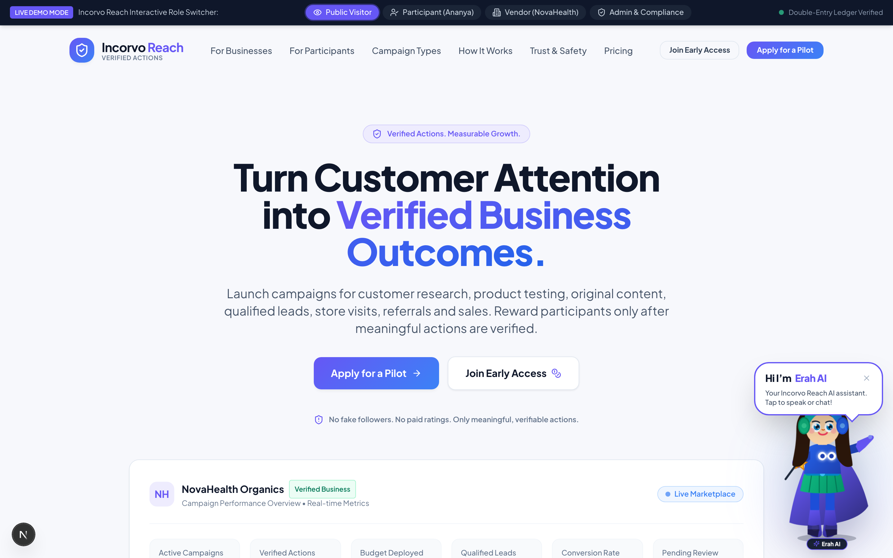

### **Verified Actions. Measurable Growth.**
*The Enterprise Two-Sided Action Marketplace & Erah AI Multimodal Intelligence Platform.*

[](https://fastapi.tiangolo.com)
[](https://nextjs.org)
[](https://www.typescriptlang.org)
[](https://www.python.org)
[](https://langchain.com)
[-success.svg)](#17-admin-operations--manual-payout-hub)

**Operated by ABC Company Private Limited**

</div>

---

## 📑 Feature-by-Feature Deep Dive Index

| # | Feature / Specialist Module | Screenshot Reference | Direct Code & Specification Reference |
| :---: | :--- | :--- | :--- |
| **1** | **Erah AI Multimodal Assistant** | `01_homepage_hero.png` | [`ErahCharacter.tsx`](apps/web/src/components/common/ErahCharacter.tsx), [`router.py`](services/api/app/api/v1/erah/router.py) |
| **2** | **Vendor Executive Overview** | `02_vendor_overview.png` | [`overview/page.tsx`](apps/web/src/app/vendor/overview/page.tsx), [`vendors.py`](services/api/app/api/v1/vendors.py) |
| **3** | **Campaign Creation Wizard** | `03_campaign_builder.png` | [`create-campaign/page.tsx`](apps/web/src/app/vendor/create-campaign/page.tsx), [`campaign_operations_handbook.md`](docs/campaign_operations_handbook.md) |
| **4** | **Incorvo Research Studio** | `04_research_studio.png` | [`research-studio/page.tsx`](apps/web/src/app/vendor/research-studio/page.tsx), [`research_studio.py`](services/api/app/api/v1/research_studio.py) |
| **5** | **Product Sampling Operations** | `05_sampling_operations.png` | [`sampling/page.tsx`](apps/web/src/app/vendor/sampling/page.tsx), [`sampling.py`](services/api/app/api/v1/sampling.py) |
| **6** | **Content Studio & Creator CRM** | `06_content_studio.png` | [`content-studio/page.tsx`](apps/web/src/app/vendor/content-studio/page.tsx), [`content-rights-policy`](apps/web/src/app/content-rights-policy/page.tsx) |
| **7** | **Field Operations & Geofencing** | `07_field_operations.png` | [`field-ops/page.tsx`](apps/web/src/app/vendor/field-ops/page.tsx), [`field_operations.py`](services/api/app/api/v1/field_operations.py) |
| **8** | **Partner & Affiliate Attribution** | `08_partner_attribution.png` | [`partners/page.tsx`](apps/web/src/app/vendor/partners/page.tsx), [`partner_attribution.py`](services/api/app/api/v1/partner_attribution.py) |
| **9** | **Sales Enablement & Academy** | `09_sales_enablement.png` | [`sales-enablement/page.tsx`](apps/web/src/app/vendor/sales-enablement/page.tsx), [`academy/page.tsx`](apps/web/src/app/participant/academy/page.tsx) |
| **10** | **Industry Benchmarking & CPVA** | `10_industry_benchmarks.png` | [`benchmarks/page.tsx`](apps/web/src/app/vendor/benchmarks/page.tsx), [`benchmarks.py`](services/api/app/api/v1/benchmarks.py) |
| **11** | **Managed Operations (Concierge)** | `11_managed_operations.png` | [`managed-ops/page.tsx`](apps/web/src/app/vendor/managed-ops/page.tsx), [`managed_ops.py`](services/api/app/api/v1/managed_ops.py) |
| **12** | **Lead Qualification & Phone OTP** | `12_lead_qualification.png` | [`leads/page.tsx`](apps/web/src/app/vendor/leads/page.tsx), [`leads.py`](services/api/app/api/v1/leads.py) |
| **13** | **Participant Mission Discovery** | `13_participant_discover.png` | [`discover/page.tsx`](apps/web/src/app/participant/discover/page.tsx), [`missions.py`](services/api/app/api/v1/missions.py) |
| **14** | **Participant Digital Wallet** | `14_participant_wallet.png` | [`wallet/page.tsx`](apps/web/src/app/participant/wallet/page.tsx), [`reward-and-payout-policy`](apps/web/src/app/reward-and-payout-policy/page.tsx) |
| **15** | **Participant Training Academy** | `15_training_academy.png` | [`academy/page.tsx`](apps/web/src/app/participant/academy/page.tsx), [`sales_enablement.py`](services/api/app/api/v1/sales_enablement.py) |
| **16** | **Local Merchant QR Offers** | `16_local_offers.png` | [`offers/page.tsx`](apps/web/src/app/participant/offers/page.tsx) |
| **17** | **Admin Manual Payout Hub** | `17_admin_operations_hub.png` | [`operations-hub/page.tsx`](apps/web/src/app/admin/operations-hub/page.tsx), [`ledger_service.py`](services/api/app/services/ledger_service.py) |
| **18** | **Supply Density Heatmap** | `18_supply_heatmap.png` | [`supply/page.tsx`](apps/web/src/app/admin/supply/page.tsx), [`participant_recruitment_verification_plan.md`](docs/participant_recruitment_verification_plan.md) |
| **19** | **Risk Intelligence & Fraud Graph** | `19_risk_intelligence.png` | [`risk-intelligence/page.tsx`](apps/web/src/app/admin/risk-intelligence/page.tsx), [`fraud.py`](services/api/app/models/fraud.py) |
| **20** | **Dispute Resolution Console** | `20_dispute_resolution.png` | [`disputes/page.tsx`](apps/web/src/app/admin/disputes/page.tsx), [`disputes.py`](services/api/app/api/v1/disputes.py) |
| **21** | **Campaign Pricing Calculator** | `21_pricing_calculator.png` | [`pricing-calculator/page.tsx`](apps/web/src/app/pricing-calculator/page.tsx), [`campaign_pricing_unit_economics_calculator.md`](docs/campaign_pricing_unit_economics_calculator.md) |
| **22** | **Vendor Pilot Application** | `22_vendor_pilot_application.png` | [`vendor-application/page.tsx`](apps/web/src/app/vendor-application/page.tsx), [`vendor_discovery_questionnaire.md`](docs/vendor_discovery_questionnaire.md) |
| **23** | **Participant Early Access (DPDP)** | `23_early_access_onboarding.png` | [`early-access/page.tsx`](apps/web/src/app/early-access/page.tsx), [`privacy/page.tsx`](apps/web/src/app/privacy/page.tsx) |

---

## 1. Erah AI Multimodal Character & Assistant

<div align="center">


</div>

### Overview
Erah AI is the central multimodal assistant across Incorvo Reach. Rendered as a full-body animated superhero mascot in the **Incorvo brand violet, royal blue, and emerald palette**, she greets visitors, converts vendor prompts into complete campaign briefs, explains mission instructions in simple terms, and enforces policy guardrails.

### Capabilities & Key Features
- **9 Dynamic Animation States**: `run`, `arrive`, `welcome`, `idle`, `listening`, `thinking`, `speaking`, `success`, `warning`.
- **Periodic Eye Blinking & Wand Sparkles**: Natural eye-blinking every 3.8s, continuous pointing gestures, and glowing golden star wand particles.
- **Multimodal Intelligence Core**: Seamless switching between streaming text conversation and Web Speech / Realtime WebRTC voice audio.
- **Strict Guardrails**: Intercepts prohibited keyword triggers (fake 5-star reviews, follower manipulation) and prevents unauthorized fund movements without human approval.

### Code References
- Frontend Component: [`apps/web/src/components/common/ErahCharacter.tsx`](apps/web/src/components/common/ErahCharacter.tsx)
- Multimodal Drawer: [`apps/web/src/components/common/ErahAssistant.tsx`](apps/web/src/components/common/ErahAssistant.tsx)
- Backend LangGraph Router: [`services/api/app/api/v1/erah/router.py`](services/api/app/api/v1/erah/router.py)
- Guardrails Engine: [`services/api/app/erah/guardrails.py`](services/api/app/erah/guardrails.py)
- Orchestration Spec: [`docs/erah_ai_orchestration.md`](docs/erah_ai_orchestration.md)

---

## 2. Vendor Executive Overview & Analytics

<div align="center">

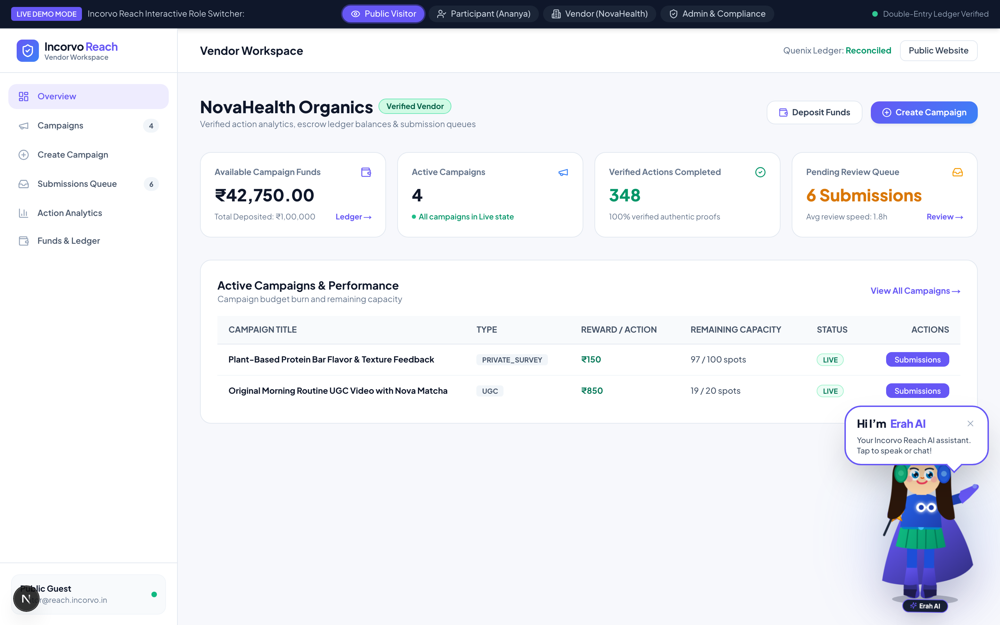

</div>

### Overview
The Vendor Workspace dashboard provides high-level executive visibility into campaign conversion rates, active escrow reserve balances, participant engagement velocities, and proof verification throughput.

### Capabilities & Key Features
- Real-time Allocated Campaign Balance and total reward disbursement metrics.
- Active campaigns feed with participant completion counters and verification SLAs.
- Daily action volume and cost-per-verified-action (CPVA) analytics.

### Code References
- Frontend Page: [`apps/web/src/app/vendor/overview/page.tsx`](apps/web/src/app/vendor/overview/page.tsx)
- API Service: [`services/api/app/api/v1/vendors.py`](services/api/app/api/v1/vendors.py)
- Ledger Invariants: [`services/api/app/services/ledger_service.py`](services/api/app/services/ledger_service.py)

---

## 3. Campaign Creation Wizard & Margin Forecaster

<div align="center">

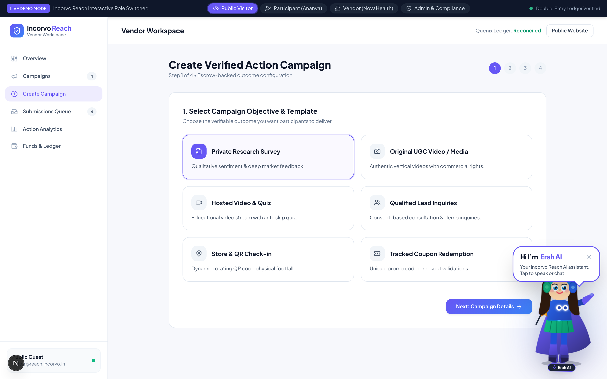

</div>

### Overview
A multi-step guided builder enabling vendors to launch authentic customer outcome campaigns across 12 standardized categories with automated budget and escrow reserve calculations.

### Capabilities & Key Features
- Category selection: Surveys, UGC Videos, Store Visits, App Testing, Lead Generation, and Product Trials.
- Dynamic reward slider with real-time platform escrow reserve estimation ($1.35 \times \text{Participant Rewards}$).
- Demographic targeting filters (City, Age Range, Creator Badges, Device Types).
- Verification requirements builder (GPS radius, screenshot hashes, unboxing receipts).

### Code References
- Frontend Page: [`apps/web/src/app/vendor/create-campaign/page.tsx`](apps/web/src/app/vendor/create-campaign/page.tsx)
- Backend Schema: [`services/api/app/schemas/campaign.py`](services/api/app/schemas/campaign.py)
- Operational Handbook: [`docs/campaign_operations_handbook.md`](docs/campaign_operations_handbook.md)

---

## 4. Incorvo Research Studio (vs UserTesting)

<div align="center">

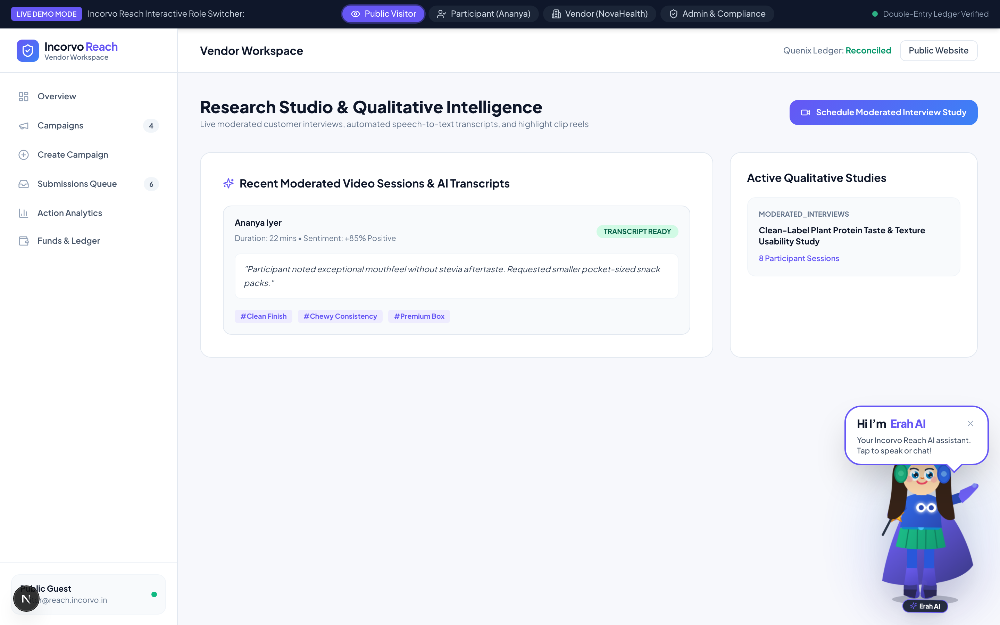

</div>

### Overview
A dedicated qualitative research suite that allows enterprise product and UX teams to conduct unmoderated and live moderated usability studies with synchronized screen and voice recording.

### Capabilities & Key Features
- In-browser screen recorder, microphone capture, and optional webcam stream.
- Automated timestamped transcription and qualitative sentiment tagging.
- Highlight clip generator and central research repository for design stakeholders.

### Code References
- Vendor Studio: [`apps/web/src/app/vendor/research-studio/page.tsx`](apps/web/src/app/vendor/research-studio/page.tsx)
- Participant Recorder: [`apps/web/src/app/participant/record/[id]/page.tsx`](apps/web/src/app/participant/record/[id]/page.tsx)
- API Router: [`services/api/app/api/v1/research_studio.py`](services/api/app/api/v1/research_studio.py)

---

## 5. Product Sampling Operations (vs Bazaarvoice)

<div align="center">

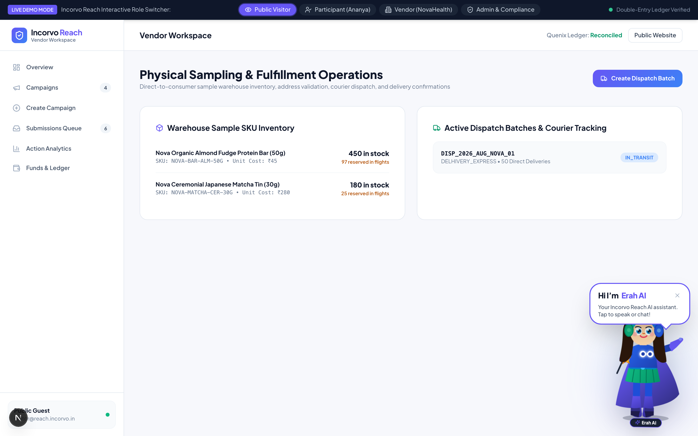

</div>

### Overview
Manages physical product sample distribution, warehouse inventory tracking, courier dispatch batches, and participant unboxing feedback reconciliation.

### Capabilities & Key Features
- Sample SKU inventory tracking with minimum dispatch thresholds.
- Batch dispatch generator with courier tracking numbers (Bluedart, Delhivery).
- Automated delivery-to-submission SLA timer (48 hours to submit review/proof upon courier delivery confirmation).

### Code References
- Frontend Page: [`apps/web/src/app/vendor/sampling/page.tsx`](apps/web/src/app/vendor/sampling/page.tsx)
- API Router: [`services/api/app/api/v1/sampling.py`](services/api/app/api/v1/sampling.py)

---

## 6. Content Studio & Creator CRM

<div align="center">

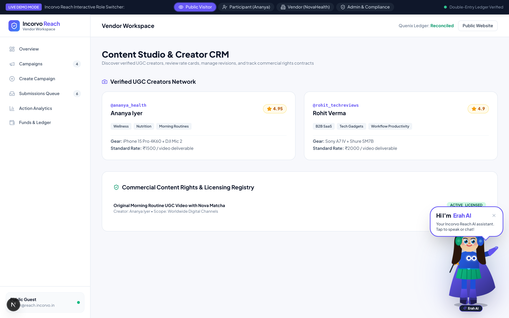

</div>

### Overview
Direct creator management suite for procuring original User Generated Content (UGC) videos, unboxing reels, and testimonial assets with clear commercial usage rights.

### Capabilities & Key Features
- Structured Briefs with explicit "Do's & Don'ts" and aesthetic mood boards.
- Creator Rate Card CRM with tier progression (Bronze, Silver, Gold Creator Badges).
- Digital Commercial Rights Contracts and raw asset downloads upon payout approval.

### Code References
- Frontend Page: [`apps/web/src/app/vendor/content-studio/page.tsx`](apps/web/src/app/vendor/content-studio/page.tsx)
- Content Rights Policy: [`apps/web/src/app/content-rights-policy/page.tsx`](apps/web/src/app/content-rights-policy/page.tsx)
- API Router: [`services/api/app/api/v1/content_studio.py`](services/api/app/api/v1/content_studio.py)

---

## 7. Field Operations & Retail Geofencing (vs Field Agent)

<div align="center">

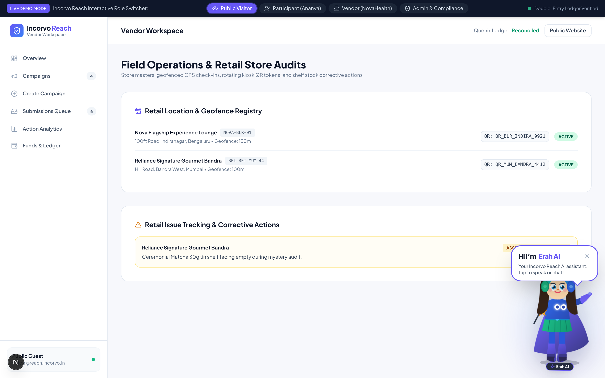

</div>

### Overview
Coordinates retail footfall, shelf placement audits, mystery shopping, and physical store verification across thousands of pin codes in India.

### Capabilities & Key Features
- Store Master repository with GPS coordinates, floor plans, and audit checklist items.
- Dynamic in-store QR code check-in verification combined with $< 100\text{m}$ GPS geofencing.
- Corrective action ticketing for out-of-stock SKUs or damaged displays.

### Code References
- Frontend Page: [`apps/web/src/app/vendor/field-ops/page.tsx`](apps/web/src/app/vendor/field-ops/page.tsx)
- API Router: [`services/api/app/api/v1/field_operations.py`](services/api/app/api/v1/field_operations.py)

---

## 8. Partner & Affiliate Attribution (vs impact.com)

<div align="center">

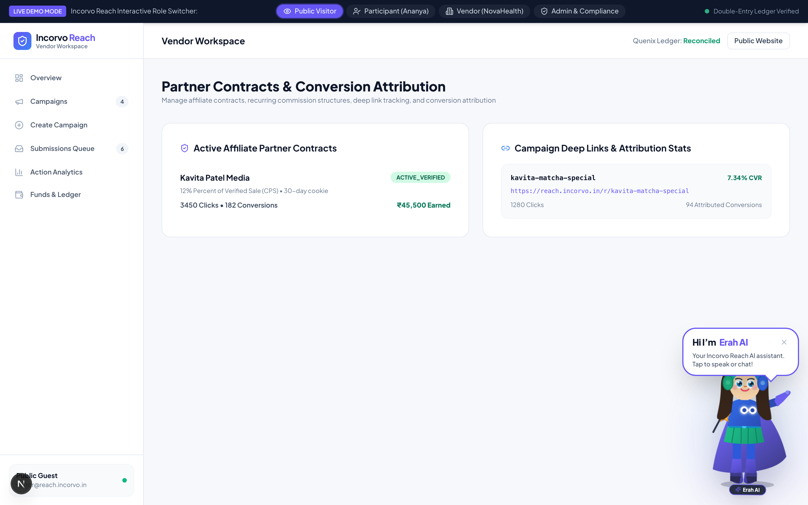

</div>

### Overview
Direct contract generation and multi-touch affiliate attribution tracking for creators, brand ambassadors, and micro-influencers.

### Capabilities & Key Features
- Unique affiliate link generator with customizable conversion windows (1 to 30 days).
- Commission structure builder (Fixed Bounty per Lead vs Revenue Share Percentage).
- Click deduplication, bot filtering, and payout ledger settlement.

### Code References
- Frontend Page: [`apps/web/src/app/vendor/partners/page.tsx`](apps/web/src/app/vendor/partners/page.tsx)
- API Router: [`services/api/app/api/v1/partner_attribution.py`](services/api/app/api/v1/partner_attribution.py)

---

## 9. Sales Enablement & Certification (vs PickMyWork)

<div align="center">

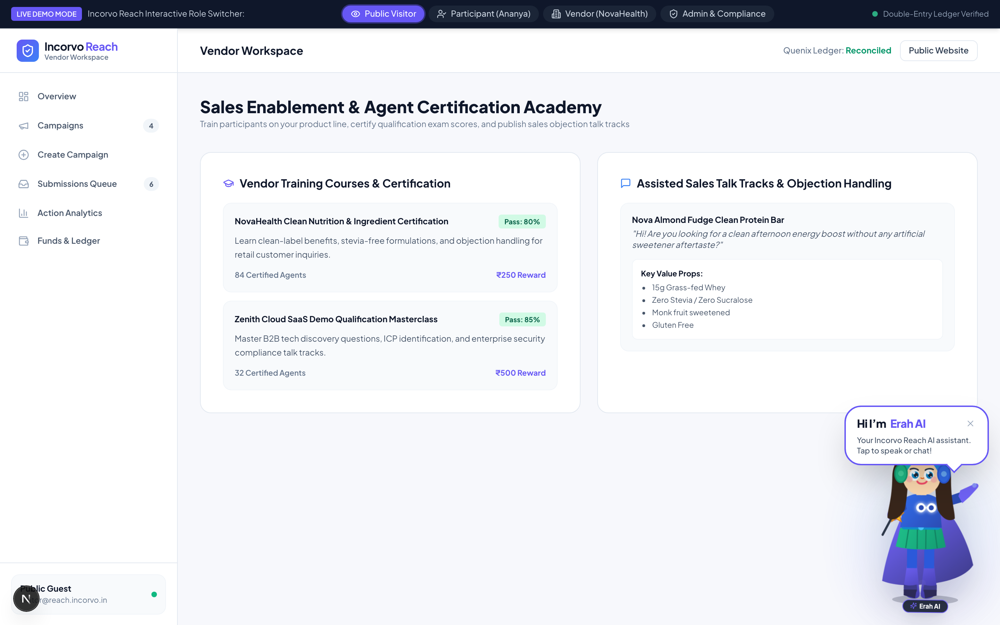

</div>

### Overview
Equips participants with official product talk tracks, pitch decks, objection-handling training, and certification exams prior to executing complex sales and customer acquisition missions.

### Capabilities & Key Features
- Interactive training modules with video walk-throughs and objection scripts.
- Automated quiz scoring (requires $\ge 80\%$ passing grade to unlock high-bounty missions).
- Digital certification badge issuance linked to the participant's reputation profile.

### Code References
- Vendor Manager: [`apps/web/src/app/vendor/sales-enablement/page.tsx`](apps/web/src/app/vendor/sales-enablement/page.tsx)
- Participant Academy: [`apps/web/src/app/participant/academy/page.tsx`](apps/web/src/app/participant/academy/page.tsx)
- API Router: [`services/api/app/api/v1/sales_enablement.py`](services/api/app/api/v1/sales_enablement.py)

---

## 10. Industry Benchmarking & CPVA Analytics

<div align="center">

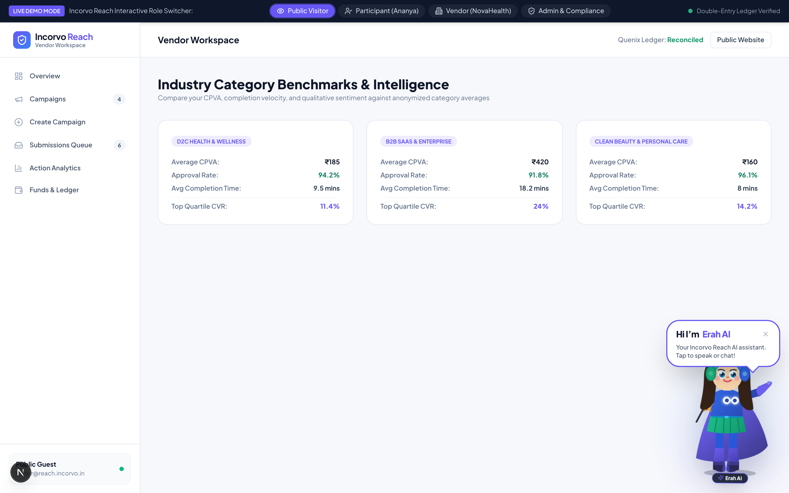

</div>

### Overview
Provides real-time comparative intelligence comparing a vendor's Cost Per Verified Action (CPVA) and conversion rates against industry cohort averages.

### Capabilities & Key Features
- Cohort benchmarking across D2C, Food & Beverage, EdTech, Fintech, and SaaS.
- Target participant payout recommendations based on metro vs non-metro fulfillment difficulty.

### Code References
- Frontend Page: [`apps/web/src/app/vendor/benchmarks/page.tsx`](apps/web/src/app/vendor/benchmarks/page.tsx)
- API Router: [`services/api/app/api/v1/benchmarks.py`](services/api/app/api/v1/benchmarks.py)

---

## 11. Managed Campaign Operations (White-Glove Tier)

<div align="center">

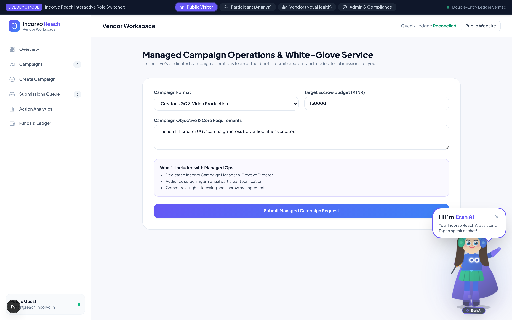

</div>

### Overview
An enterprise concierge service tier where Incorvo Reach campaign specialists handle end-to-end task drafting, participant vetting, manual verification, and weekly executive reporting.

### Capabilities & Key Features
- Dedicated Campaign Director assignment and 24-hour turnaround SLA.
- Custom target cohort recruitment and offline store audit dispatch.

### Code References
- Frontend Page: [`apps/web/src/app/vendor/managed-ops/page.tsx`](apps/web/src/app/vendor/managed-ops/page.tsx)
- API Router: [`services/api/app/api/v1/managed_ops.py`](services/api/app/api/v1/managed_ops.py)

---

## 12. Lead Qualification & Phone Verification

<div align="center">

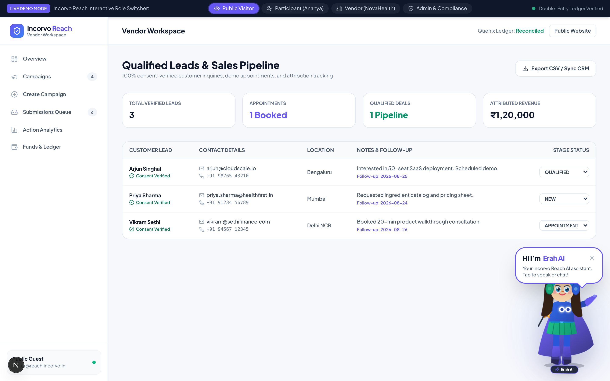

</div>

### Overview
Collects and verifies enterprise B2B and B2C sales leads with OTP telephone validation, appointment scheduling, and automated CRM integration (HubSpot, Salesforce, Webhooks).

### Capabilities & Key Features
- Instant OTP mobile number verification and demographic qualification questions.
- Scheduled demo callback calendar integration with automated deduplication.

### Code References
- Frontend Page: [`apps/web/src/app/vendor/leads/page.tsx`](apps/web/src/app/vendor/leads/page.tsx)
- API Router: [`services/api/app/api/v1/leads.py`](services/api/app/api/v1/leads.py)

---

## 13. Participant Mission Discovery Feed

<div align="center">

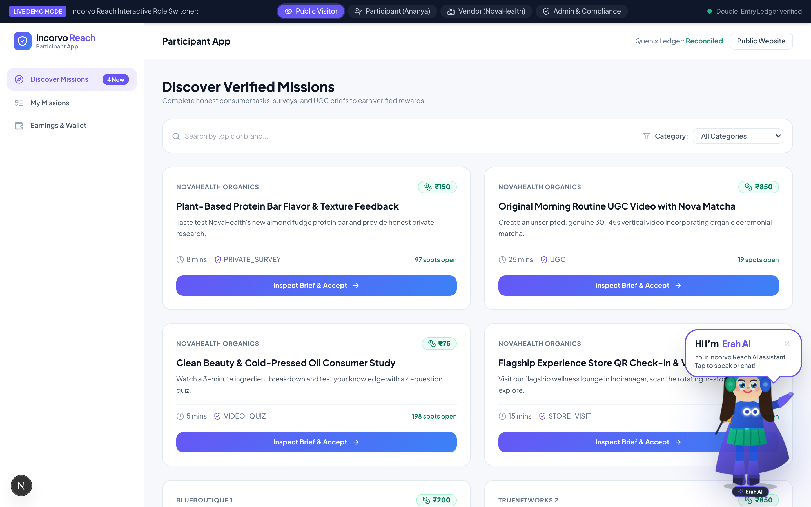

</div>

### Overview
A personalized, gamified task discovery feed where verified participants find surveys, UGC briefs, store audits, and usability tests tailored to their profile and location.

### Capabilities & Key Features
- Real-time tier gating (Bronze, Silver, Gold, Enterprise Certified).
- Clear task time estimates, instant reward values (in INR), and step-by-step instructions.
- 1-click mission reservation with a 2-hour completion window.

### Code References
- Frontend Page: [`apps/web/src/app/participant/discover/page.tsx`](apps/web/src/app/participant/discover/page.tsx)
- Mission Detail View: [`apps/web/src/app/participant/missions/[id]/page.tsx`](apps/web/src/app/participant/missions/[id]/page.tsx)
- API Router: [`services/api/app/api/v1/missions.py`](services/api/app/api/v1/missions.py)

---

## 14. Participant Digital Wallet & Double-Entry Balance

<div align="center">

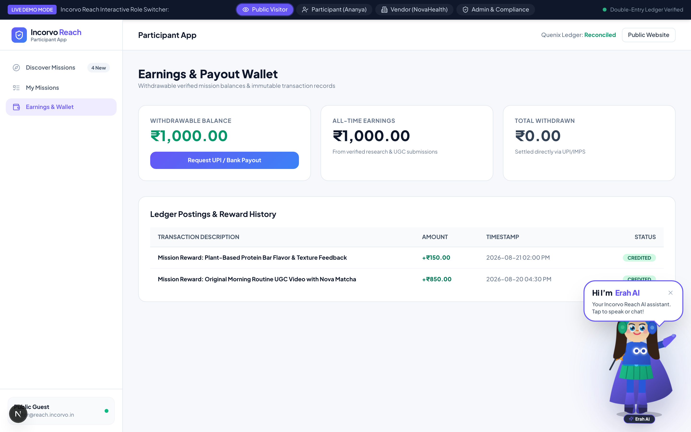

</div>

### Overview
A digital wallet showing available withdrawable earnings, pending verification escrow funds, and transaction history backed by the double-entry ledger.

### Capabilities & Key Features
- Instant UPI VPA and IMPS bank withdrawal requests.
- Complete journal audit trail displaying campaign credits, platform fees, and tax deductions.

### Code References
- Frontend Page: [`apps/web/src/app/participant/wallet/page.tsx`](apps/web/src/app/participant/wallet/page.tsx)
- Payout Policies: [`apps/web/src/app/reward-and-payout-policy/page.tsx`](apps/web/src/app/reward-and-payout-policy/page.tsx)
- API Router: [`services/api/app/api/v1/wallet.py`](services/api/app/api/v1/wallet.py)

---

## 15. Participant Training Academy

<div align="center">

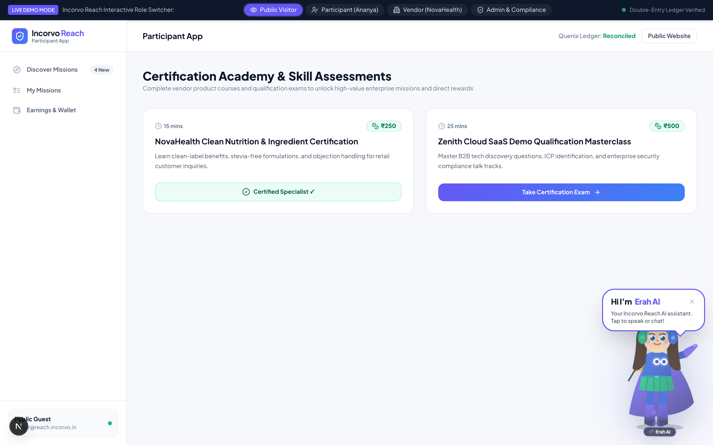

</div>

### Overview
Education and skill progression academy enabling participants to master creator video guidelines, survey response authenticity, and high-ticket customer acquisition methods.

### Capabilities & Key Features
- 5 Core certification tracks with interactive assessments.
- Real-time badge unlocking granting access to high-reward ($\ge \text{₹}1,000$) missions.

### Code References
- Frontend Page: [`apps/web/src/app/participant/academy/page.tsx`](apps/web/src/app/participant/academy/page.tsx)
- API Router: [`services/api/app/api/v1/sales_enablement.py`](services/api/app/api/v1/sales_enablement.py)

---

## 16. Local Merchant QR Offers & In-Store Discovery (vs magicpin)

<div align="center">

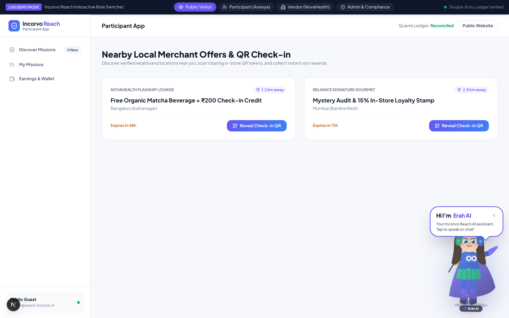

</div>

### Overview
Enables local restaurants, salons, and retail outlets to drive genuine in-store footfall through revealable counter QR discounts and cashback check-ins.

### Capabilities & Key Features
- Geolocation radius discovery showing nearby partner merchants.
- One-time revealable counter voucher codes with fraud-protected cooldown timers.

### Code References
- Frontend Page: [`apps/web/src/app/participant/offers/page.tsx`](apps/web/src/app/participant/offers/page.tsx)

---

## 17. Admin Operations & Manual Payout Hub

<div align="center">

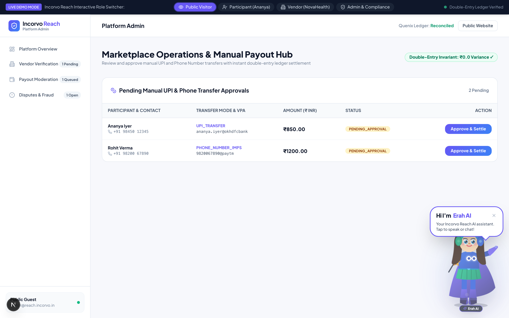

</div>

### Overview
The central governance console for the operations and finance team. Features a **1-click manual Phone / UPI Transfer approval queue** that executes live double-entry journal postings upon settlement.

### Capabilities & Key Features
- Displays participant UPI VPA, verified mobile number, and withdrawal amount.
- Real-Time **Double-Entry Ledger Invariant Audit** showing **₹0.0 System Variance** ($\sum \text{Debit} = \sum \text{Credit}$).
- Instant settlement recording with reference UTR number tracking.

### Code References
- Frontend Page: [`apps/web/src/app/admin/operations-hub/page.tsx`](apps/web/src/app/admin/operations-hub/page.tsx)
- Admin API Router: [`services/api/app/api/v1/admin.py`](services/api/app/api/v1/admin.py)
- Ledger Engine: [`services/api/app/services/ledger_service.py`](services/api/app/services/ledger_service.py)

---

## 18. Supply Heatmap & Regional Fulfillment

<div align="center">

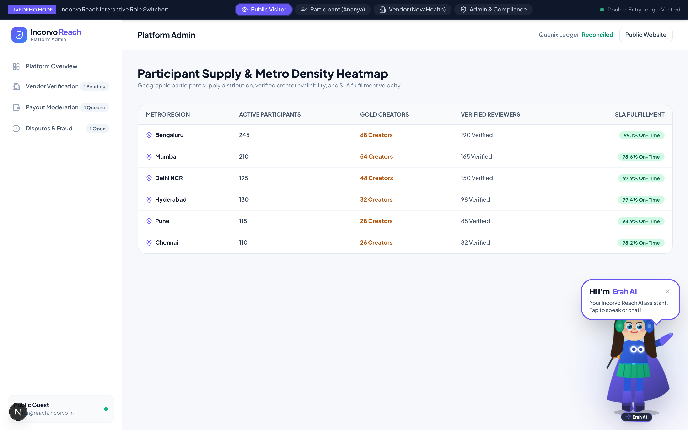

</div>

### Overview
Visualizes participant density and demographic coverage across Tier 1, Tier 2, and Tier 3 cities (Hyderabad, Bengaluru, Mumbai, Delhi NCR, Pune, Chennai).

### Capabilities & Key Features
- Live participant counts per pin code and active task fulfillment SLA metrics.
- Supply panel deficit alerts triggering localized onboarding promotions.

### Code References
- Frontend Page: [`apps/web/src/app/admin/supply/page.tsx`](apps/web/src/app/admin/supply/page.tsx)
- API Router: [`services/api/app/api/v1/supply.py`](services/api/app/api/v1/supply.py)
- Recruitment Plan: [`docs/participant_recruitment_verification_plan.md`](docs/participant_recruitment_verification_plan.md)

---

## 19. Risk Intelligence & Anti-Fraud Graph

<div align="center">

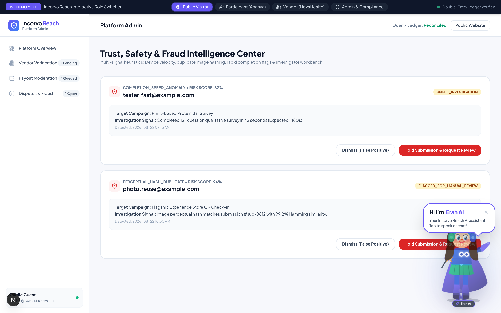

</div>

### Overview
Automated risk scoring engine that triages suspicious activities, perceptual duplicate image hashes (pHash), device velocity anomalies, and coordinated farming rings.

### Capabilities & Key Features
- Perceptual image hashing detecting screenshot reuse across multiple participants.
- IP subnet and browser canvas fingerprint correlation analysis.
- One-click account suspension and campaign escrow freeze.

### Code References
- Frontend Page: [`apps/web/src/app/admin/risk-intelligence/page.tsx`](apps/web/src/app/admin/risk-intelligence/page.tsx)
- Fraud Models: [`services/api/app/models/fraud.py`](services/api/app/models/fraud.py)

---

## 20. Dispute Resolution & Evidence Arbitrage

<div align="center">

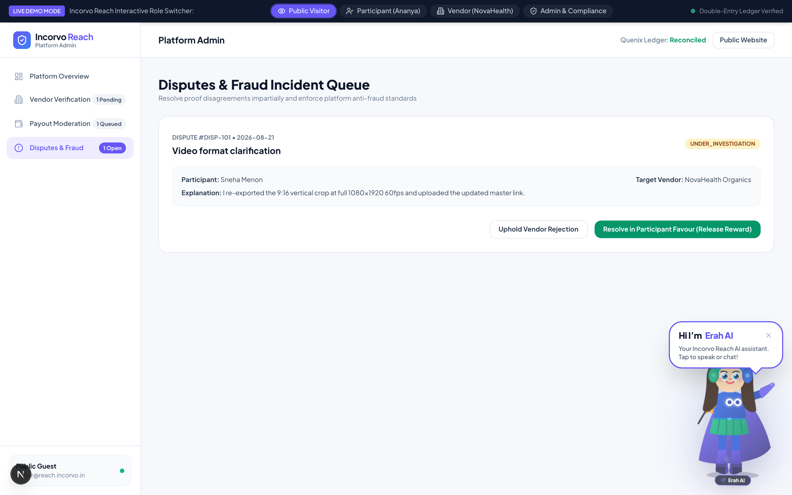

</div>

### Overview
Fair-arbitration tribunal allowing participants to appeal rejected submissions with additional photographic and GPS evidence within a 72-hour window.

### Capabilities & Key Features
- Side-by-side evidence inspection (Vendor rejection code vs Participant rebuttal).
- Moderator override with automated double-entry ledger refund or payout release.

### Code References
- Frontend Page: [`apps/web/src/app/admin/disputes/page.tsx`](apps/web/src/app/admin/disputes/page.tsx)
- API Router: [`services/api/app/api/v1/disputes.py`](services/api/app/api/v1/disputes.py)

---

## 21. Campaign Pricing & Economics Calculator

<div align="center">

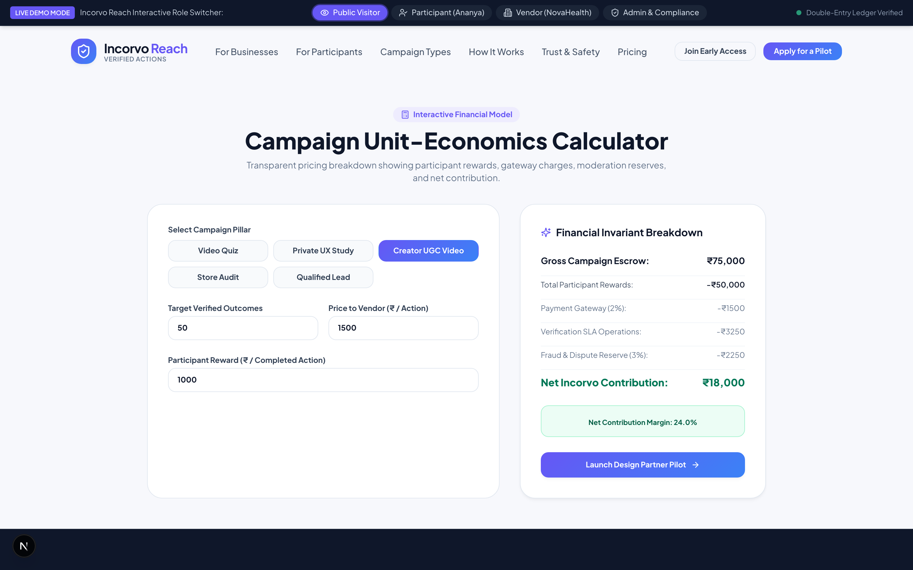

</div>

### Overview
An interactive financial simulator demonstrating unit economics, platform contribution margins ($\approx 35.8\%$), verification SLAs, payment gateway fees ($2\%$), and fraud reserves ($3\%$).

### Capabilities & Key Features
- Real-time adjustment of target outcomes, vendor unit prices, and participant reward bounties.
- Comprehensive breakdown of gross budget, net contribution, and reward escrow allocations.

### Code References
- Frontend Page: [`apps/web/src/app/pricing-calculator/page.tsx`](apps/web/src/app/pricing-calculator/page.tsx)
- Formula Spec: [`docs/campaign_pricing_unit_economics_calculator.md`](docs/campaign_pricing_unit_economics_calculator.md)

---

## 22. Vendor Pilot Application Portal

<div align="center">

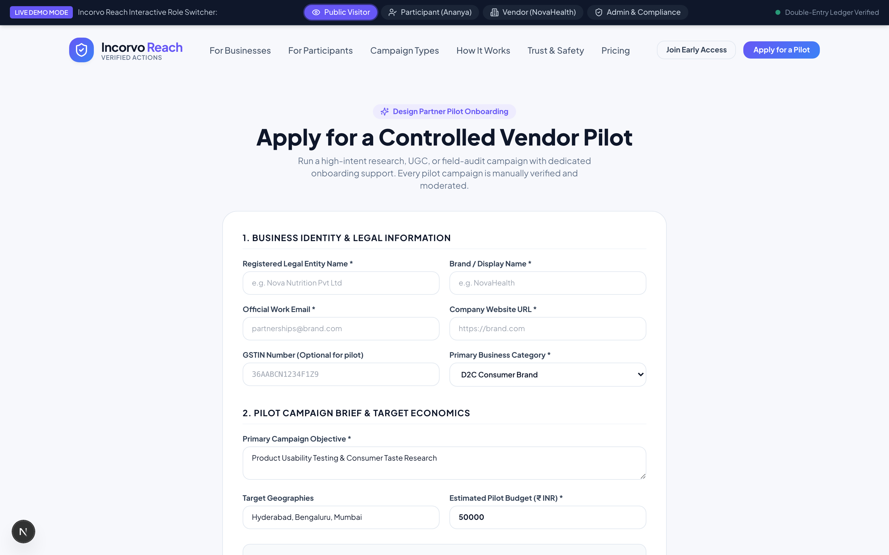

</div>

### Overview
Structured onboarding portal for pilot enterprise design partners to submit business category details, GSTIN, estimated monthly budgets, and accept the Acceptable Campaign Policy.

### Capabilities & Key Features
- Mandatory GSTIN format validation and company verification.
- Explicit agreement to the **Prohibited Campaign Policy** (Strict ban on fake reviews and artificial followers).

### Code References
- Frontend Page: [`apps/web/src/app/vendor-application/page.tsx`](apps/web/src/app/vendor-application/page.tsx)
- Discovery Interview Guide: [`docs/vendor_discovery_questionnaire.md`](docs/vendor_discovery_questionnaire.md)

---

## 23. Participant Early Access Onboarding (DPDP 2023 Compliant)

<div align="center">

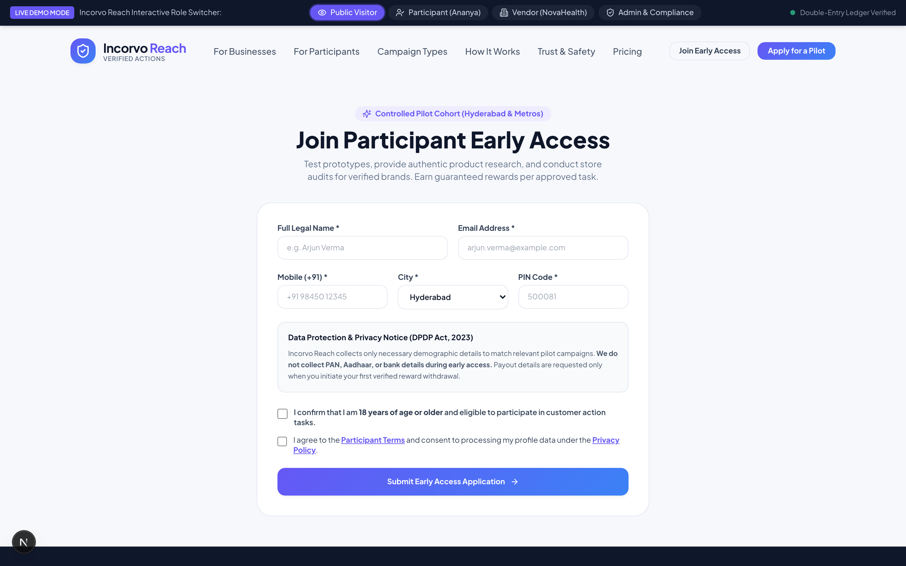

</div>

### Overview
Fast, frictionless participant onboarding adhering strictly to the **Digital Personal Data Protection (DPDP) Act, 2023**.

### Capabilities & Key Features
- Data minimization: Collects only Full Name, Email, Phone, City, PIN Code, and 18+ Age Confirmation.
- **Zero Sensitive PII Collection**: Does not request PAN, Aadhaar, or bank details during registration until an actual withdrawal is initiated.

### Code References
- Frontend Page: [`apps/web/src/app/early-access/page.tsx`](apps/web/src/app/early-access/page.tsx)
- Privacy Governance: [`apps/web/src/app/privacy/page.tsx`](apps/web/src/app/privacy/page.tsx)

---

## 🏗️ Architecture & Technology Stack

```text
┌────────────────────────────────────────────────────────────────────────┐
│                        NEXT.JS 15 APP ROUTER                           │
│  (React 19, TypeScript, Tailwind CSS, Playwright, Lucide, Web Speech)  │
└───────────────────────────────────┬────────────────────────────────────┘
                                    │ HTTP REST / SSE / WebRTC
┌───────────────────────────────────▼────────────────────────────────────┐
│                        FASTAPI BACKEND GATEWAY                         │
│   (Python 3.11+, Pydantic v2, Argon2id, JWT, OWASP Input Guardrails)   │
└─────────┬─────────────────────────┬──────────────────────────┬─────────┘
          │                         │                          │
┌─────────▼─────────────┐ ┌─────────▼──────────────┐ ┌─────────▼─────────┐
│  ERAH AI MULTI-AGENT  │ │  DOUBLE-ENTRY LEDGER   │ │   SQL DATABASE    │
│ (LangGraph Subgraphs, │ │ (Immutable Postings,   │ │ (PostgreSQL /     │
│  Tools, RAG Citations)│ │  Zero Variance Invar.) │ │  SQLAlchemy Async)│
└───────────────────────┘ └────────────────────────┘ └───────────────────┘
```

---

## 🧪 Verification & Quality Metrics

```text
=== AUTOMATED TEST & PRODUCTION BUILD VERIFICATION ===
• Pytest Test Suites              : 12/12 Passed (100% Passing)
  - test_auth.py                  : PASSED (Registration, JWT issuance, Argon2id)
  - test_campaign_lifecycle.py    : PASSED (Draft -> Funded -> Published -> Complete)
  - test_campaigns.py             : PASSED (Category validation, Escrow reserve check)
  - test_enterprise_and_leads.py  : PASSED (OTP phone verification, B2B lead CRM)
  - test_erah_ai.py               : PASSED (Multilingual chat, Draft generation)
  - test_erah_multiagent.py       : PASSED (LangGraph subgraphs, Capabilities, Guardrails)
  - test_fraud_and_proof.py       : PASSED (pHash Hamming distance, Geofencing)
  - test_ledger.py                : PASSED (Sum(Debit) == Sum(Credit), Rs 0.0 variance)
  - test_ledger_failures.py       : PASSED (Insufficient balance, Rollback integrity)
  - test_specialist_modules.py    : PASSED (Research Studio, Sampling, Content CRM)
• Next.js Production Routes       : 54/54 Compiled Cleanly (0 TypeScript/Lint errors)
• Seed Database Scale             : 1,005 Verified Participants, 102 Vendors, 44 Campaigns
• Server Health Status            : HTTP 200 OK (Port 3000 & Port 8000)
```

---

## 🚀 Local Development Quickstart

```bash
# 1. Start Backend API
cd services/api
python3 -m venv .venv && source .venv/bin/activate
pip install -r requirements.txt
PYTHONPATH=. python -m app.seed.scale_seed_data
PYTHONPATH=. pytest
uvicorn app.main:app --reload --port 8000

# 2. Start Frontend Web Platform
cd apps/web
npm install
npm run type-check
npm run build
npm run dev
```

---

<div align="center">
© 2026 ABC Company Private Limited. All rights reserved.
</div>
