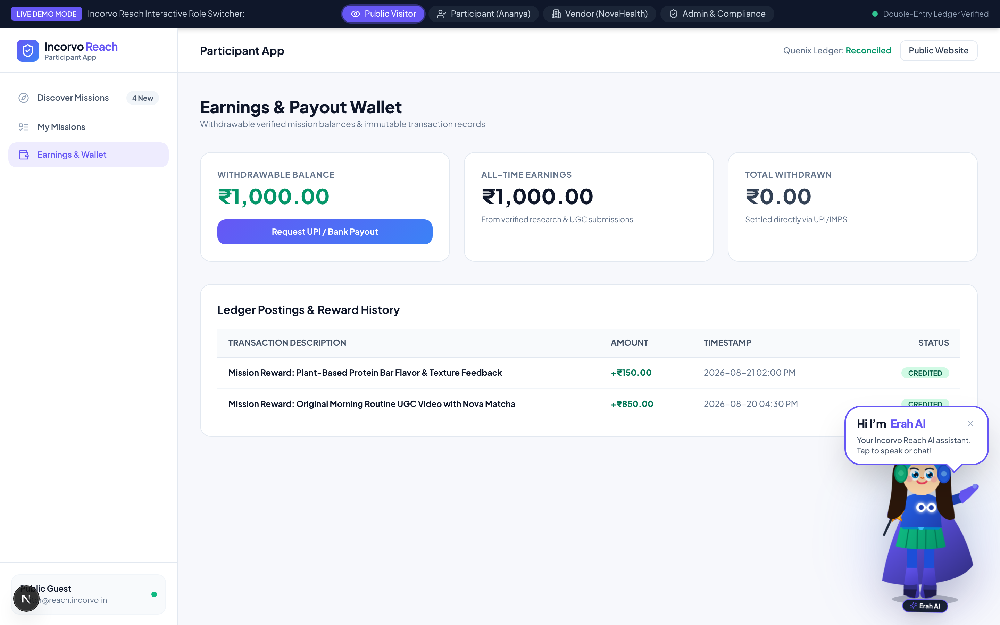
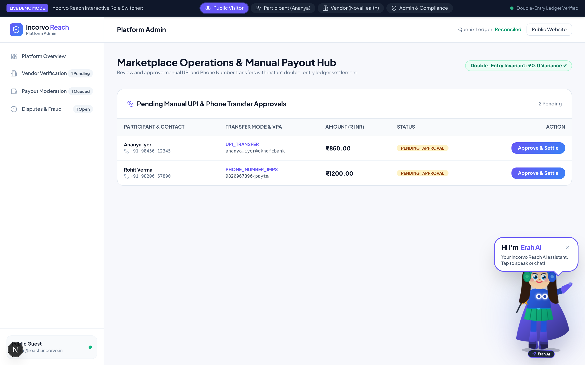
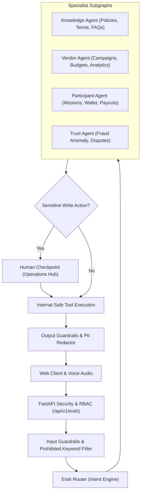

# Incorvo Reach

<div align="center">


### **Verified Actions. Measurable Growth.**
*The Enterprise Two-Sided Action Marketplace & Erah AI Multimodal Intelligence Platform.*

[](https://fastapi.tiangolo.com)
[](https://nextjs.org)
[](https://www.typescriptlang.org)
[](https://www.python.org)
[](https://langchain.com)
[](#governance)

**Operated by Quenix Analytics Private Limited**

</div>

---

## 📖 Table of Contents

- [1. Executive Summary](#1-executive-summary)
- [2. Platform Visual Tour & Screenshots](#2-platform-visual-tour--screenshots)
  - [Erah AI Multimodal Assistant](#erah-ai-multimodal-assistant)
  - [Vendor Workspace & Campaign Creation](#vendor-workspace--campaign-creation)
  - [Specialist Operations Hubs](#specialist-operations-hubs)
  - [Participant Experience & Digital Wallet](#participant-experience--digital-wallet)
  - [Admin Operations & Payout Settlement Hub](#admin-operations--payout-settlement-hub)
  - [Pilot Onboarding & Financial Margin Simulators](#pilot-onboarding--financial-margin-simulators)
- [3. Core Architecture & System Blueprints](#3-core-architecture--system-blueprints)
- [4. Erah AI Multi-Agent Engine (LangGraph)](#4-erah-ai-multi-agent-engine-langgraph)
- [5. Double-Entry Accounting & Escrow Ledger](#5-double-entry-accounting--escrow-ledger)
- [6. Anti-Fraud & Cryptographic Proof Engine](#6-anti-fraud--cryptographic-proof-engine)
- [7. API Contract & Endpoints](#7-api-contract--endpoints)
- [8. Local Development & Testing Quickstart](#8-local-development--testing-quickstart)
- [9. Governance & Legal Compliance](#9-governance--legal-compliance)

---

## 1. Executive Summary

**Incorvo Reach** is an enterprise two-sided marketplace where businesses pay exclusively for **genuine, verifiable customer actions** rather than fake social media vanity metrics.

### 🚫 Strict Policy Invariant
> **Zero Tolerance for Fake Engagement**: Incorvo Reach strictly prohibits paid likes, fake 5-star public reviews, follower manipulation, copy-paste bot comments, or advertising click farms. Every campaign requires verifiable proof, human review checkpoints, and perceptual image hashing before reward distribution.

---

## 2. Platform Visual Tour & Screenshots

### Erah AI Multimodal Assistant
Erah AI is the full-body animated AI character who guides users across Incorvo Reach via streaming text and realtime voice audio.

<div align="center">


*Erah AI in Brand Violet & Emerald Palette with Dynamic Guiding Gestures and Interactive Speech Bubble*

</div>

---

### Vendor Workspace & Campaign Creation
Vendors can create and monitor 12 standardized campaign formats with real-time budget forecasting and escrow protection.

<div align="center">


*Vendor Executive Dashboard with Real-Time Conversion Rates and Escrow Health*


*Guided Campaign Builder with Unit-Economics Margin Calculator and Geographic Targeting*

</div>

---

### Specialist Operations Hubs
Purpose-built specialist suites closing competitive gaps against legacy point solutions.

<div align="center">

#### Incorvo Research Studio (vs UserTesting)

*Qualitative Research Repository with In-Browser Screen/Voice Recording and Automated Transcripts*

#### Product Sampling Operations (vs Bazaarvoice)

*SKU Inventory Tracking, Courier Dispatch Batches, and Unboxing Proof Reconciliation*

#### Content Studio & Creator CRM

*Creator Briefs with Do's/Don'ts, Commercial Rights Contracts, and Rate Card Management*

</div>

---

### Participant Experience & Digital Wallet
Participants discover high-reward tasks, complete qualitative feedback, and withdraw verified earnings via UPI/IMPS.

<div align="center">


*Curated Mission Feed with Real-Time Tier Eligibility and Reward Badges*


*Cryptographic Participant Wallet with Double-Entry Ledger Transaction History*

</div>

---

### Admin Operations & Payout Settlement Hub
Governance console with 1-click manual Phone/UPI transfer approvals and live system ledger variance audits.

<div align="center">


*Manual UPI / IMPS Payout Settlement Queue with Rs 0.0 Ledger System Variance*

</div>

---

### Pilot Onboarding & Financial Margin Simulators
Controlled pilot registration flows compliant with **DPDP Act (2023)** and financial margin modeling.

<div align="center">

#### Real-Time Campaign Pricing Calculator

*Interactive Unit Economics Simulator Calculating Platform Margins and Escrow Reserves*

#### Controlled Pilot Vendor & Participant Onboarding

*Vendor Pilot Application with GSTIN Verification and Policy Acceptance*


*Participant Early Access Registration without Unnecessary PII Collection (DPDP 2023)*

</div>

---

## 3. Core Architecture & System Blueprints

```text
incorvo-reach/
├── apps/
│   └── web/                           # Next.js 15 App Router, React 19, Tailwind CSS
│       ├── src/app/                   # 54 Production-Compiled Routes
│       ├── src/components/common/     # ErahCharacter.tsx, ErahAssistant.tsx
│       ├── src/components/layout/     # Navbar, Footer, DashboardLayout, DemoRoleBar
│       └── messages/                  # Approved Multilingual Translation Dictionaries
├── services/
│   ├── api/                           # FastAPI Backend Gateway
│   │   ├── app/api/v1/erah/           # Erah Multi-Agent LangGraph Endpoints
│   │   ├── app/erah/                  # Orchestrator, Guardrails, Tools, Subgraphs
│   │   ├── app/models/                # SQLAlchemy Async ORM (Ledger, Users, Campaigns)
│   │   ├── app/services/              # Double-Entry Ledger Settlement Engine
│   │   └── tests/                     # 12 Pytest Test Suites (100% Passing)
├── docs/                              # Operational Handbooks & Architecture Blueprints
├── docker-compose.yml                 # Multi-Container Deployment Specification
└── README.md
```

---

## 4. Erah AI Multi-Agent Engine (LangGraph)

Erah AI is powered by internal **LangGraph Subgraphs** running behind an authenticated FastAPI gateway:



---

## 5. Double-Entry Accounting & Escrow Ledger

Incorvo Reach operates an immutable double-entry journal ledger where **total debits equal total credits** for every financial transaction.

$$\sum \text{Debit} = \sum \text{Credit} \quad (\Delta = \text{₹}0.00)$$

| Event | Account Debited | Account Credited |
| :--- | :--- | :--- |
| **Vendor Deposit** | `VENDOR_AVAILABLE` | `VENDOR_DEPOSIT` |
| **Campaign Creation** | `CAMPAIGN_REWARD_RESERVE` | `VENDOR_AVAILABLE` |
| **Mission Approved** | `PARTICIPANT_AVAILABLE` + `PLATFORM_REVENUE` | `CAMPAIGN_REWARD_RESERVE` |
| **Payout Requested** | `PAYOUT_CLEARING` | `PARTICIPANT_AVAILABLE` |
| **Admin UPI Settlement** | Bank Settlement Outflow | `PAYOUT_CLEARING` |

---

## 6. Anti-Fraud & Cryptographic Proof Engine

1. **Perceptual Image Hashing (pHash)**: Rejects duplicate screenshot submissions within a 64-bit Hamming distance of $< 5$.
2. **Geofencing & Dynamic Tokens**: Verifies device GPS coordinates within a $< 100\text{m}$ radius and scans rotating in-store QR tokens.
3. **Device Velocity Scoring**: Flags multiple participant accounts sharing browser canvas fingerprints, IP subnets, or UPI VPAs.

---

## 7. API Contract & Endpoints

### Erah AI Multi-Agent (`/api/v1/erah`)
- `POST /api/v1/erah/conversations`: Create stateful conversational thread.
- `POST /api/v1/erah/conversations/{id}/messages`: Synchronous multi-agent invocation.
- `POST /api/v1/erah/conversations/{id}/messages/stream`: **Server-Sent Events (SSE)** token streaming.
- `GET /api/v1/erah/approvals`: Retrieve sensitive actions requiring human approval.
- `POST /api/v1/erah/approvals/{id}/decision`: Resume execution (`APPROVE`, `REJECT`, `EDIT_AND_APPROVE`).
- `GET /api/v1/erah/capabilities`: Introspect active multi-agent system state.

### Marketplace & Governance (`/api/v1`)
- `POST /api/v1/auth/login`: Issue Argon2id JWT access tokens.
- `GET /api/v1/campaigns`: Filter and manage active campaigns.
- `POST /api/v1/proofs/submit`: Upload cryptographic proof deliverables.
- `POST /api/v1/admin/operations/payouts/{id}/settle`: Execute manual UPI/Phone double-entry payout.

---

## 8. Local Development & Testing Quickstart

### Prerequisites
- Node.js 20+ & npm
- Python 3.11+

### 1. Backend Service (FastAPI)

```bash
cd services/api
python3 -m venv .venv
source .venv/bin/activate
pip install -r requirements.txt

# Run scale seed data (1,005 Participants, 102 Vendors, 44 Active Campaigns)
PYTHONPATH=. python -m app.seed.scale_seed_data

# Run full Pytest test suite (12/12 passing)
PYTHONPATH=. pytest

# Start FastAPI server (Port 8000)
uvicorn app.main:app --reload --port 8000
```

*Swagger Documentation: [http://localhost:8000/docs](http://localhost:8000/docs)*

### 2. Frontend Application (Next.js 15)

```bash
cd apps/web
npm install

# Run TypeScript check & Production build (54 routes)
npm run type-check
npm run build

# Start Next.js development server (Port 3000)
npm run dev
```

*Web Platform: [http://localhost:3000](http://localhost:3000)*

---

## 9. Governance & Legal Compliance

- **Operating Entity**: **Quenix Analytics Private Limited**
- **Digital Personal Data Protection (DPDP) Act (2023) & Rules (2025)**: Strict data minimization on early access onboarding. No PAN, Aadhaar, or bank details collected until verified payout request.
- **RBI Payment Aggregator Directions (2025)**: Internal balances designated as **"Allocated Campaign Balance"** and **"Reward Reserve"**.

---

<div align="center">
© 2026 Quenix Analytics Private Limited. All rights reserved.
</div>
