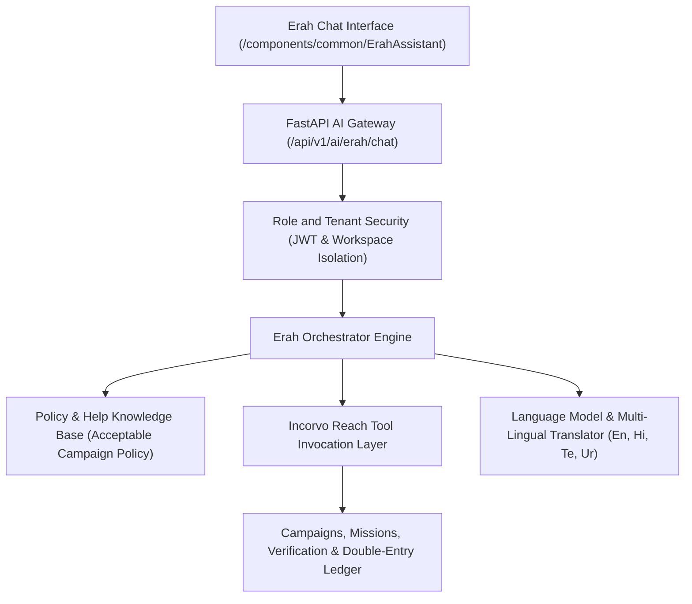

# Incorvo Reach — Erah AI Orchestration Architecture

**System**: Erah AI — Your Incorvo Reach Assistant  
**Entity**: Quenix Analytics Private Limited  
**Status**: Integrated & Test-Verified  

---

## 1. Technical Orchestration Flow

---

## 2. Incorvo Reach Tool Calling Architecture

| Tool Name | Scope | Description & Safety Guardrail |
| :--- | :--- | :--- |
| `search_campaigns()` | Participant / Vendor | Search active, policy-compliant campaigns by demographic & category. |
| `create_campaign_draft()` | Vendor | Converts conversational goals into structured brief payloads (does **not** auto-publish). |
| `calculate_campaign_budget()` | Vendor / Pricing | Simulates unit economics ($P_{\text{vendor}} - R_{\text{participant}} - \text{PG} - \text{Mod} - \text{Reserve} = \text{Margin}$). |
| `check_participant_eligibility()` | Participant | Evaluates Tier level (`BRONZE` to `ENTERPRISE PANEL`) against mission prerequisites. |
| `get_mission_status()` | Participant | Returns live submission lifecycle state (`IN_PROGRESS`, `SUBMITTED`, `REWARDED`). |
| `validate_proof_requirements()` | Participant | Pre-flight submission verification for photo resolution and word count. |
| `get_reward_status()` | Participant | Reads withdrawable wallet balance and pending manual UPI transfers. |
| `summarize_campaign_analytics()`| Vendor | Aggregates CPVA, retention curves, and qualitative participant feedback sentiment. |
| `flag_policy_violation()` | System / Admin | Intercepts prohibited keywords (paid 5-star reviews, follower manipulation) and halts drafts. |
| `create_support_ticket()` | Public / Participant | Routes disputes to human compliance officers within 24h SLA. |

---

## 3. Strict Invariant Controls & Non-Autonomous Guardrails

1. **No Autonomous Money Movement**: Erah AI cannot independently credit, debit, or release ledger funds.
2. **No Autonomous Payout Approval**: Payout requests require explicit human Finance / Admin approval via the Operations Hub.
3. **No Autonomous Publishing**: Campaign drafts require explicit vendor confirmation and escrow pre-funding.
4. **Tenant Isolation**: Strict row-level isolation guarantees that no vendor's data or participant PII is ever leaked cross-tenant.
5. **Zero Prohibited Engagement**: Erah AI categorically refuses to generate or structure fake ratings, bot views, or misleading testimonials.
