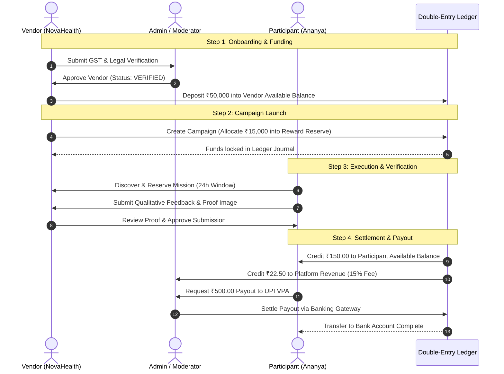
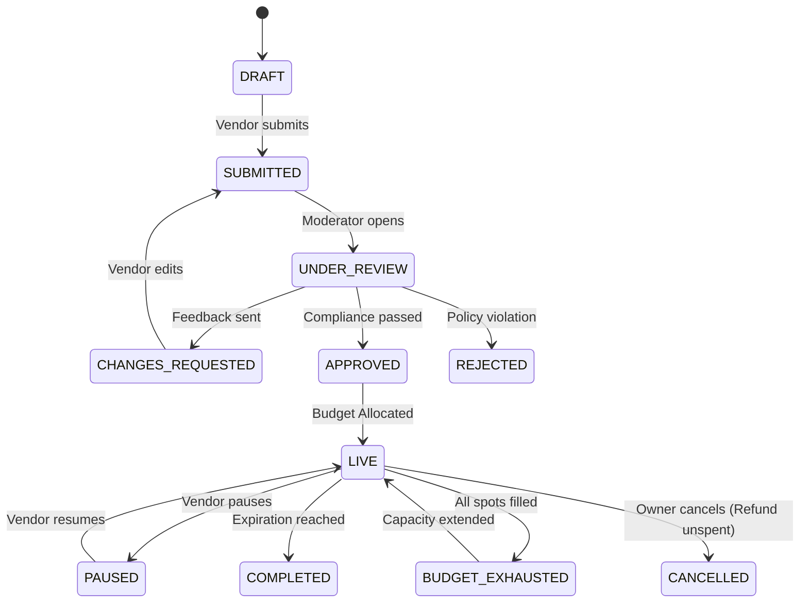
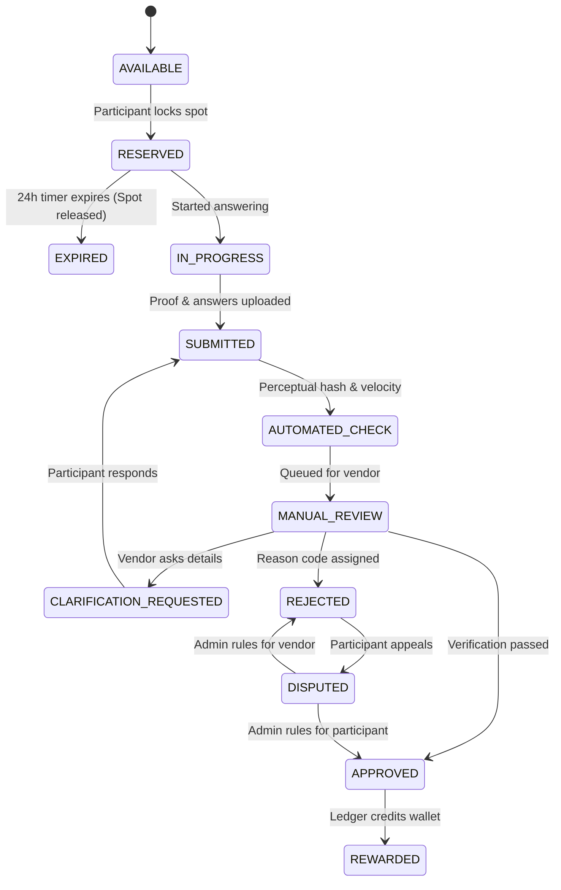
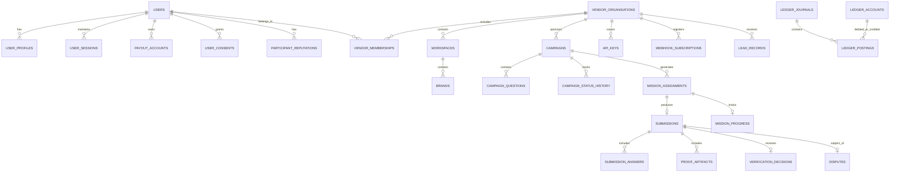

# Incorvo Reach — Master Product Architecture Blueprint

**Platform Tagline**: *Verified Actions. Measurable Growth.*  
**Parent Operating Entity**: Quenix Analytics Private Limited  
**Document Version**: 2.0.0 (Production Blueprint)

---

## 1. Executive Summary & System Positioning

Incorvo Reach is a high-trust, two-sided customer-action marketplace engineered to enable verified businesses to acquire genuine, measurable consumer outcomes—qualitative research, original user-generated content (UGC), qualified B2B/B2C leads, store QR visits, and verified referral conversions.

### Core Architectural Mandates
1. **Zero Artificial Social Engagement**: Strict algorithmic and legal prohibition against paid public reviews, 5-star rating coercion, bot views, or follower manipulation.
2. **Double-Entry Financial Invariant**: Every rupee in the system is accounted for via immutable journal postings where:
   $$\sum \text{Debit Postings} \equiv \sum \text{Credit Postings}$$
3. **Multi-Tenant Enterprise Isolation**: Support for individual brands, multi-location franchises, and agencies managing multiple client workspaces with separated billing and role-based permissions.

---

## 2. Complete Platform Sitemap & Screen Inventory

The platform comprises five unified applications connected through responsive PWA interfaces:

```mermaid
graph TD
    Root["Incorvo Reach Platform"]
    
    Root --> Pub["1. Public Marketing & Legal"]
    Root --> Part["2. Participant Portal (PWA)"]
    Root --> Vend["3. Vendor & Agency Workspace"]
    Root --> Mod["4. Moderator & Operations Workbench"]
    Root --> Admin["5. Super-Administration & Governance"]
    
    Pub --> P1["Homepage (/)"]
    Pub --> P2["For Businesses (/for-businesses)"]
    Pub --> P3["Campaign Types (/campaign-types)"]
    Pub --> P4["Earn Rewards (/earn-rewards)"]
    Pub --> P5["How It Works (/how-it-works)"]
    Pub --> P6["Pricing (/pricing)"]
    Pub --> P7["Trust & Safety (/trust-and-safety)"]
    Pub --> P8["Legal Policies (/terms, /privacy, /acceptable-campaign-policy)"]
    Pub --> P9["Help & Contact (/help, /contact)"]
    
    Part --> PT1["Discover Missions Feed (/participant/discover)"]
    Part --> PT2["Mission Briefing (/participant/missions/[id])"]
    Part --> PT3["Task Execution & Proof Upload (/participant/execute/[id])"]
    Part --> PT4["My Missions Status Board (/participant/my-missions)"]
    Part --> PT5["Creator Reputation & Badges (/participant/reputation)"]
    Part --> PT6["Earnings & UPI Payout Wallet (/participant/wallet)"]
    
    Vend --> V1["Vendor Overview Metrics (/vendor/overview)"]
    Vend --> V2["Campaign Catalog & Duplicator (/vendor/campaigns)"]
    Vend --> V3["AI Campaign Creation Wizard (/vendor/create-campaign)"]
    Vend --> V4["Submission Moderation Queue (/vendor/submissions)"]
    Vend --> V5["CRM Leads & Pipeline (/vendor/leads)"]
    Vend --> V6["Team Members & RBAC (/vendor/team)"]
    Vend --> V7["Action Analytics & Funnel ROI (/vendor/analytics)"]
    Vend --> V8["Developer Platform & Webhooks (/vendor/developer)"]
    Vend --> V9["Funds & Ledger Journals (/vendor/funds)"]
    
    Mod --> M1["Submission Review Queue (/admin/submissions)"]
    Mod --> M2["Dispute Arbitration (/admin/disputes)"]
    Mod --> M3["Risk Intelligence & Duplicate Hashes (/admin/risk-intelligence)"]
    
    Admin --> A1["Governance Overview (/admin/overview)"]
    Admin --> A2["Vendor Verification Queue (/admin/vendors)"]
    Admin --> A3["Payout Queue & Settlement (/admin/payouts)"]
    Admin --> A4["System Audit Log Explorer (/admin/audit)"]
```

---

## 3. User-Role Permission Matrix (RBAC)

| Resource / Capability | Public Visitor | Participant | Vendor Reviewer | Vendor Manager | Vendor Owner | Moderator | Super Admin |
| :--- | :---: | :---: | :---: | :---: | :---: | :---: | :---: |
| **Browse Public Campaigns** | ✅ | ✅ | ✅ | ✅ | ✅ | ✅ | ✅ |
| **Accept & Execute Missions** | ❌ | ✅ | ❌ | ❌ | ❌ | ❌ | ❌ |
| **Request UPI/Bank Payouts** | ❌ | ✅ | ❌ | ❌ | ❌ | ❌ | ❌ |
| **Create / Edit Campaigns** | ❌ | ❌ | ❌ | ✅ | ✅ | ❌ | ✅ |
| **Deposit Campaign Funds** | ❌ | ❌ | ❌ | ❌ | ✅ | ❌ | ✅ |
| **Cancel Campaign & Refund** | ❌ | ❌ | ❌ | ❌ | ✅ | ❌ | ✅ |
| **Review / Clarify Proofs** | ❌ | ❌ | ✅ | ✅ | ✅ | ✅ | ✅ |
| **Manage Team & Invite Roles** | ❌ | ❌ | ❌ | ❌ | ✅ | ❌ | ✅ |
| **Generate API Keys & Webhooks** | ❌ | ❌ | ❌ | ✅ | ✅ | ❌ | ✅ |
| **Verify Vendor Organizations** | ❌ | ❌ | ❌ | ❌ | ❌ | ✅ | ✅ |
| **Arbitrate Formal Disputes** | ❌ | ❌ | ❌ | ❌ | ❌ | ✅ | ✅ |
| **Execute Platform Payouts** | ❌ | ❌ | ❌ | ❌ | ❌ | ❌ | ✅ |

---

## 4. End-to-End "Golden Path" Workflow

---

## 5. State Machines

### 5.1 Campaign Lifecycle State Machine

### 5.2 Mission & Submission Lifecycle State Machine

---

## 6. PostgreSQL Relational Entity-Relationship (ER) Diagram

---

## 7. Complete Double-Entry Ledger Architecture

### Ledger Account Types
1. `VENDOR_DEPOSIT`: Tracks gross deposited funds by the vendor.
2. `VENDOR_AVAILABLE`: Unallocated balance available for new campaign launches.
3. `CAMPAIGN_REWARD_RESERVE`: Allocated campaign funds held for in-flight accepted missions.
4. `PARTICIPANT_AVAILABLE`: Earned rewards withdrawable via UPI / Bank transfer.
5. `PLATFORM_REVENUE`: 15% Incorvo Reach marketplace commission.
6. `PAYOUT_CLEARING`: Outbound transit account during payment gateway transfer.

### Journal Entry Invariants

| Action | Debited Account (Debit +) | Credited Account (Credit +) |
| :--- | :--- | :--- |
| **Vendor Deposit** | `VENDOR_AVAILABLE` | `VENDOR_DEPOSIT` |
| **Campaign Budget Lock** | `CAMPAIGN_REWARD_RESERVE` | `VENDOR_AVAILABLE` |
| **Campaign Cancellation Refund** | `VENDOR_AVAILABLE` | `CAMPAIGN_REWARD_RESERVE` |
| **Mission Approved Settlement** | `PARTICIPANT_AVAILABLE` + `PLATFORM_REVENUE` | `CAMPAIGN_REWARD_RESERVE` |
| **Payout Request** | `PAYOUT_CLEARING` | `PARTICIPANT_AVAILABLE` |
| **Payout Failed Reversal** | `PARTICIPANT_AVAILABLE` | `PAYOUT_CLEARING` |

---

## 8. FastAPI Endpoint Contract Reference

### Authentication & Users
* `POST /api/v1/auth/register/participant` — Register participant with interest cohorts
* `POST /api/v1/auth/register/vendor` — Register business organization with GST
* `POST /api/v1/auth/login` — Password login (returns access & refresh tokens)
* `POST /api/v1/auth/otp/request` & `POST /api/v1/auth/otp/verify` — Phone OTP verification
* `GET /api/v1/users/export-data` — GDPR personal data export
* `POST /api/v1/users/delete-account` — Account deletion request

### Campaigns & Builder
* `GET /api/v1/campaigns` — Marketplace feed with filters
* `POST /api/v1/campaigns` — Multi-step campaign creation with ledger allocation
* `POST /api/v1/campaigns/{id}/pause` & `POST /api/v1/campaigns/{id}/resume`
* `POST /api/v1/campaigns/{id}/cancel` — Release unspent funds back to vendor
* `POST /api/v1/campaigns/{id}/extend` — Top-up capacity and budget

### Missions & Verification
* `POST /api/v1/missions/{id}/accept` — Reserve mission spot (24h lock)
* `POST /api/v1/missions/assignments/{id}/submit` — Upload answers and proof artifacts
* `POST /api/v1/vendors/submissions/{id}/review` — Approve, reject, or request clarification
* `POST /api/v1/proofs/signed-upload-url` — S3 signed URL generator with MIME check

### Wallet & Payouts
* `GET /api/v1/wallet/summary` — Withdrawable balance & total earnings
* `GET /api/v1/wallet/transactions` — Double-entry posting history
* `POST /api/v1/wallet/payout` — Initiate UPI/Bank payout (₹500 threshold)

### AI, CRM & Developer Platform
* `POST /api/v1/ai/campaign-assistant` — Generate briefs, headlines, and pricing
* `GET /api/v1/leads` & `PATCH /api/v1/leads/{id}/status` — CRM pipeline management
* `POST /api/v1/developer/keys` & `GET /api/v1/developer/keys` — API key management
* `POST /api/v1/developer/webhooks` — Webhook subscription dispatcher
